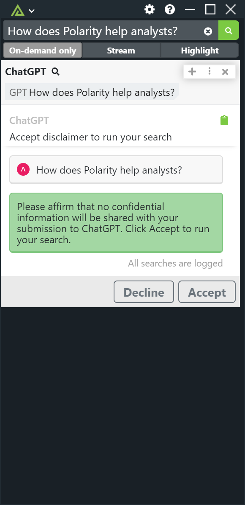
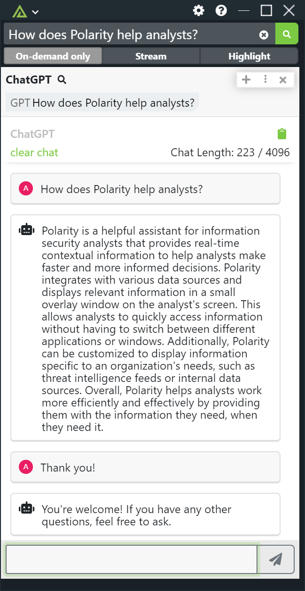

# Polarity ChatGPT Integration

The Polarity ChatGPT integration leverages the OpenAI ChatGPT REST API to answer your questions.  The integration will respond to any search terms that end in a question mark. Note that multi-line strings will not be searched to reduce false positive searches.

> For more information on OpenAI ChatGPT please see  https://platform.openai.com/overview

The ChatGPT API is limited to conversations with less than 4096 tokens.  The integration keeps the history of your chat locally to provide context for ChatGPT but will not work over 4096 tokens. The integration includes a token counter and allows you to clear your conversation if it is getting too long.

|  |  
|----------------------------------------------|-------------------------|
| *Configure a Search Disclaimer*              | *Chat Example*          |

## ChatGPT Integration Options

### API Key

A valid OpenAI Chat GPT API key.

### OpenAI Model

The ID of the model to use when accessing the OpenAI ChatGPT API. Your API key must have access to the model or you will receive a 404 error.

### Show Search Disclaimer

If enabled, the integration will show a disclaimer the user must accept before running a search. 

### Search Disclaimer Content

A disclaimer that users must review before the integration will submit questions to the ChatGPT API.

### Disclaimer Interval

How often to display the disclaimer to users. Restarting the integration will reset the interval timer.

### Log Searches

If enabled, the integration will log all searches sent to ChatGPT including searches where the user did not accept the disclaimer.

## Installation Instructions

Installation instructions for integrations are provided on the [PolarityIO GitHub Page](https://polarityio.github.io/).

## Polarity

Polarity is a memory-augmentation platform that improves and accelerates analyst decision making.  For more information about the Polarity platform please see:

https://polarity.io/
